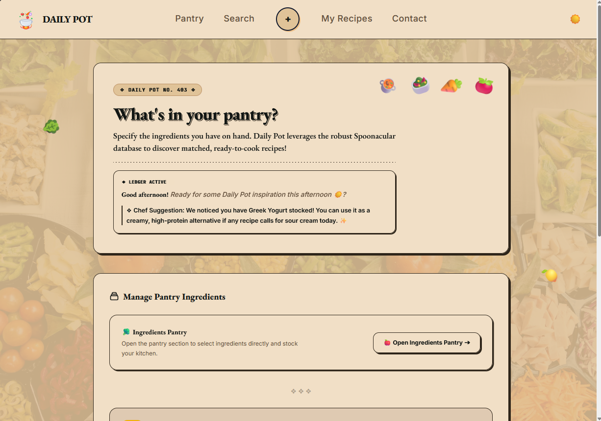

# 🍲 Daily Pot – Smart Pantry & Meal Planner

![UI Preview]

**Daily Pot** is a lightning-fast, client-side web application designed to eliminate food waste and simplify culinary planning. By tracking your current kitchen inventory, Daily Pot acts as an intelligent assistant that finds matched recipes, suggests ingredient substitutions, and helps you schedule your weekly meals—all running seamlessly in your browser without the need for a traditional backend.

---

## ✨ Key Features

* **🛒 Dynamic Pantry Management:** Add, remove, and track your kitchen ingredients with a single click using the "Quick Stock Presets". All data is instantly persisted using `localStorage`.
* **🔍 Smart Recipe Matching Engine:** Powered by the Spoonacular API, the app calculates a precise "Match %" for hundreds of recipes based strictly on what you already have in your pantry.
* **🧠 Intelligent Substitution System:** Missing an ingredient? The built-in engine proactively suggests viable alternatives (e.g., swapping butter for margarine or white sugar for honey) to ensure you can still cook the meal.
* **📅 Meal Calendar & Planner:** Organize your week by scheduling favorited or custom-published recipes for Breakfast, Lunch, or Dinner.
* **📝 Custom Recipe Studio:** A dynamic publishing tool that allows you to author your own culinary masterpieces and save them directly to your local workspace.
* **🛡️ Offline Fallback Database:** Designed with graceful degradation in mind. If network connectivity drops or API quotas are exceeded, the app seamlessly switches to a rich local database of over 60 pre-loaded recipes.
* **🌓 Adaptive UI & Dark Mode:** Built with a modern, asymmetric "Bento Grid" layout that is fully responsive. Features a native Dark Mode toggle tailored for low-light kitchen environments.

---

## 🛠️ Technology Stack

This project was built with a strong focus on native performance, avoiding heavy JavaScript frameworks to ensure zero-latency DOM manipulation.

* **Core:** HTML5, Vanilla TypeScript / JavaScript (ES6+)
* **Styling:** Tailwind CSS (Utility-first approach)
* **Data Persistence:** Web Storage API (`localStorage`)
* **External API:** [Spoonacular REST API](https://spoonacular.com/food-api)
* **Architecture:** Serverless Client-Side Application

---

## 🚀 Getting Started

Follow these steps to run the Daily Pot application locally on your machine.

### Prerequisites
* A modern web browser (Chrome, Firefox, Safari, Edge).
* [Node.js](https://nodejs.org/) (optional, if you want to use a local development server like Vite or Live Server).
* A free API key from Spoonacular.

### Installation

1. **Clone the repository:**
   ```bash
   git clone [https://github.com/YourUsername/daily-pot.git](https://github.com/YourUsername/daily-pot.git)
   cd daily-pot